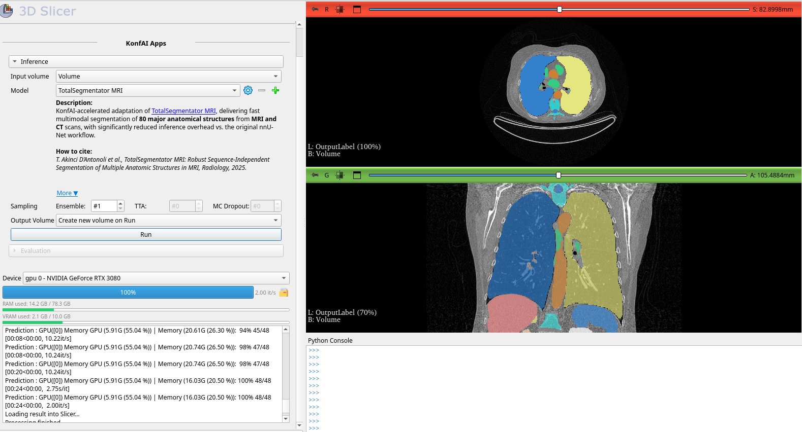
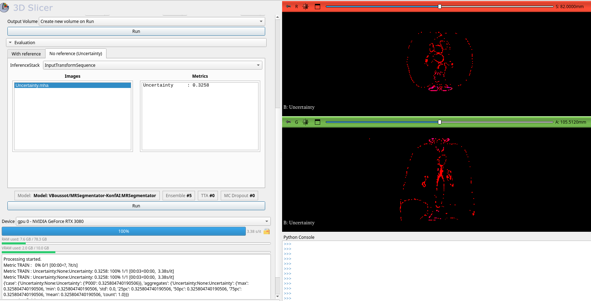
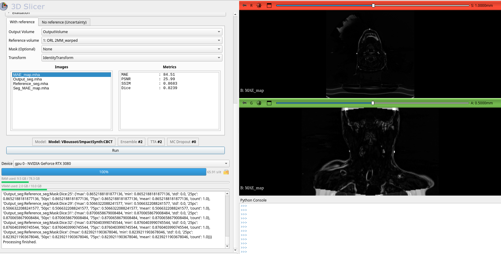

# SlicerKonfAI


SlicerKonfAI is a **3D Slicer extension** that provides a graphical user interface (GUI) to run **AI workflows for medical imaging** directly inside Slicer, such as **multi-organ segmentation** and **synthetic CT (sCT) generation**.

With SlicerKonfAI, **you can** load patient images, select an AI App, run inference, and immediately visualize results as Slicer volumes or segmentations.  
It also includes built-in **Quality Assurance (QA)** tools:
- **Reference-based evaluation** (when ground truth is available)
- **Reference-free uncertainty estimation** (when no ground truth is available)

> If you are a developer who wants to create or package new Apps, see the **Developer** section below.

---

## 🖼️ Interface Overview

| Inference interface | Uncertainty interface |
|-------------------------|------------------------|
|  |  |
| *Figure 1 – Inference.* | *Figure 2 – Uncertainty estimation.* |

<p align="center">
  <br>
  <em>Figure 3 – Evaluation with reference.</em>
</p>

---

## ✅ What you can do in 3 minutes (step-by-step tutorial)

This quick tutorial demonstrates the typical clinical workflow: **load → run inference → review results → assess reliability**.

### 1) Install and open the module
1. Install **3D Slicer ≥ 5.6**
2. Open **3D Slicer** and go to **Extension Manager**
3. Search for **KonfAI**
4. Click **Install**
5. Restart Slicer and open the **KonfAI** module from the **Pipeline** category

### 2) Load a case
1. In Slicer, click **DICOM** (or drag-and-drop a NIfTI / NRRD / MHA file)
2. Load a volume (e.g., `volume.nii.gz`)
3. Confirm the volume appears in the **Data** module and is visible in the slice views

### 3) Run inference
1. On KonfAI module go to the **Inference** tab
2. Select:
   - **Input volume**: `volume`
   - **KonfAI App**: choose an app (e.g., *TotalSegmentator* or *MRSegmentator*)
3. Click **Run**
4. Wait for completion: outputs are automatically loaded back into Slicer as:
   - **Segmentation nodes** (organs, anatomical structures, tumors)
   - **Volume nodes** (probability maps, heatmaps, synthetic CT, etc., depending on the app)

✅ You can now inspect the results in 2D and 3D and adjust visualization (opacity, label colors, 3D rendering).

### 4) QA without reference (uncertainty estimation)
When no ground truth annotation is available, you can still assess prediction reliability.

1. Go to the **Evaluation** tab and select **No reference (Uncertainty)**
2. Select the **inference stack volume** generated during prediction
3. Click **Run**
4. Review the generated uncertainty outputs (depending on the app), typically:
   - uncertainty maps / heatmaps
   - voxel-wise confidence measures
   - summary metrics

Uncertainty can be computed using:
- test-time augmentation (TTA)
- stochastic dropout
- multi-model ensembling

### 5) QA with reference (optional)
If a reference annotation (ground truth) is available:

1. Load the reference segmentation or volume
2. Go to the **Evaluation** tab
3. Select:
   - **Output volume**
   - **Reference volume**
   - Optional **ROI mask**
4. Click **Run**
5. Review quantitative metrics and qualitative overlays inside Slicer

---

## ✨ Features

### **• Hugging Face–Hosted Apps**
SlicerKonfAI automatically discovers and downloads *KonfAI Apps* hosted on Hugging Face. No manual installation is required: select an App from the list and it becomes instantly available. You can also add your own Apps to the workspace.

### **• Fast Inference via KonfAI Apps**
SlicerKonfAI runs KonfAI Apps directly inside Slicer, following the exact inference workflow defined in each App. This includes image preprocessing, model execution, and output reconstruction. The system supports GPU acceleration and optimized runtime performance to deliver fast, clinically usable inference.

### **• Quality Assurance (QA)**
SlicerKonfAI provides two complementary QA modules that assess prediction reliability by executing the App’s evaluation or uncertainty workflow, which can produce both quantitative metrics and qualitative output images:

- **Reference-based QA** : automatic comparison between predictions and available ground-truth annotations.
- **Reference-free QA**: uncertainty estimation when no reference is available, using:
  - TTA  
  - Stochastic dropout  
  - Multi-model ensembling

### **• Tight integration with Slicer**
  Use volumes already loaded in Slicer (DICOM, NRRD, NIfTI, etc.) as inputs and write results back as:

  * Volume nodes (e.g. synthetic CT, logits, heatmaps)
  * Label maps / segmentation nodes (e.g. organ masks, tumor masks)

### **• Configurable Apps root**  
  The workflows inside each App can be modified or extended (e.g., adding new evaluation metrics or custom processing steps), and SlicerKonfAI will automatically use the updated configuration.

### **• Built-in State-of-the-Art Apps**
  By default, SlicerKonfAI includes several state-of-the-art KonfAI Apps for tasks such as anatomical segmentation and synthetic CT generation, providing ready-to-use baselines for experimentation and clinical evaluation.

---

SlicerKonfAI is built on top of the **KonfAI** , a fully configurable and modular deep learning framework that defines complete training, inference, and evaluation workflows through YAML files, enabling reproducible, transparent, and advanced medical imaging pipelines.

For more information about KonfAI, visit the project repository: https://github.com/vboussot/KonfAI

---

## 🧑‍💻 Developer documentation

### 🧩 What is a KonfAI App?

A **KonfAI App** is a self-contained workflow package built with KonfAI.  
It defines how a model is executed, how its outputs are generated, and how optional evaluation or uncertainty workflows are performed.  
Apps are portable, versioned, and can be executed identically from Python, the command line, or SlicerKonfAI.

A typical KonfAI App contains:

- **A trained model** (single checkpoint or ensemble)
- **Workflow configuration files** (`Prediction.yml`, `Evaluation.yml`, `Uncertainty.yml`) defining inference, evaluation, and uncertainty pipelines
- **A metadata file** (`app.json`) describing the App for SlicerKonfAI

A minimal App directory may look like:

```text
my_konfai_app/
├── app.json                # Metadata for SlicerKonfAI
├── Prediction.yml         # Inference config used by SlicerKonfAI
├── Evaluation.yml         # (Optional) evaluation workflow
├── Uncertainty.yml        # (Optional) uncertainty workflow
└── checkpoint.pt          # Checkpoint used by Prediction.yml
```

An example `app.json` could be:

```json
{
    "display_name": "Lung Lobe Segmentation",
    "short_description": "Deep learning model for segmenting lung lobes on CBCT scans.",
    "description": "This App performs domain adaptation by first synthesizing a CT-like volume from the input CBCT, followed by lung lobe segmentation using a 3D UNet-based model.",
    "tta": 4,
    "mc_dropout": 0
}
```

SlicerKonfAI uses this metadata to:

- Display the App name and description
- Enable App-specific options such as TTA or dropout

---

### ⚙️ How SlicerKonfAI runs an App (conceptual)

Internally, SlicerKonfAI typically:

1. Prepares a temporary working directory for the current case.
2. Exports the selected Slicer nodes to disk in MHA format, as expected by the App.
3. Executes the App by calling the KonfAI Apps CLI. For example, an inference call may look like:

   ```bash
   konfai-apps infer \
       -i Volume.mha \
       -o Output
       --ensemble 2
       --tta 2
       --mc 0
       --gpu 0
   ```
4. Monitors the running process (stdout/stderr) and streams logs to the Slicer interface.
5. Imports the generated outputs back into Slicer (volumes, segmentations, uncertainty maps, metrics).

## 📚 References

Boussot, V. & Dillenseger, J.-L., **KonfAI: A Modular and Fully Configurable Framework for Deep Learning in Medical Imaging.** *arXiv:2508.09823*, 2025.  

--- 

> SlicerKonfAI = GUI + data exchange + process manager

> KonfAI = the engine that does all computations.

---


