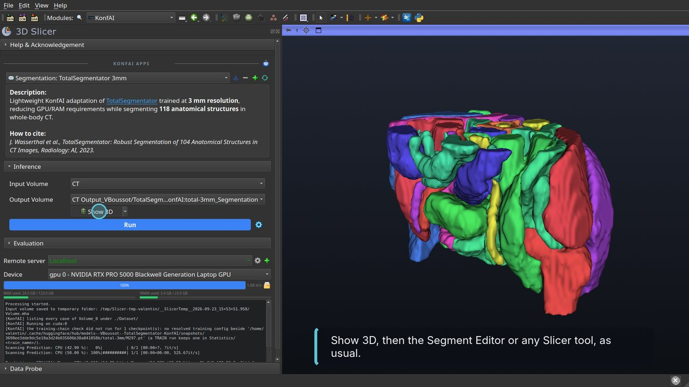
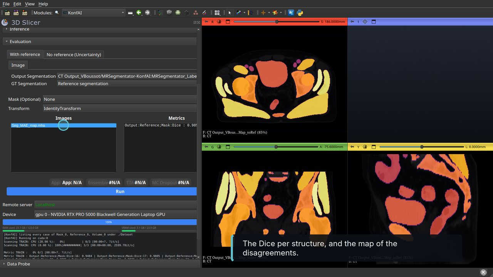
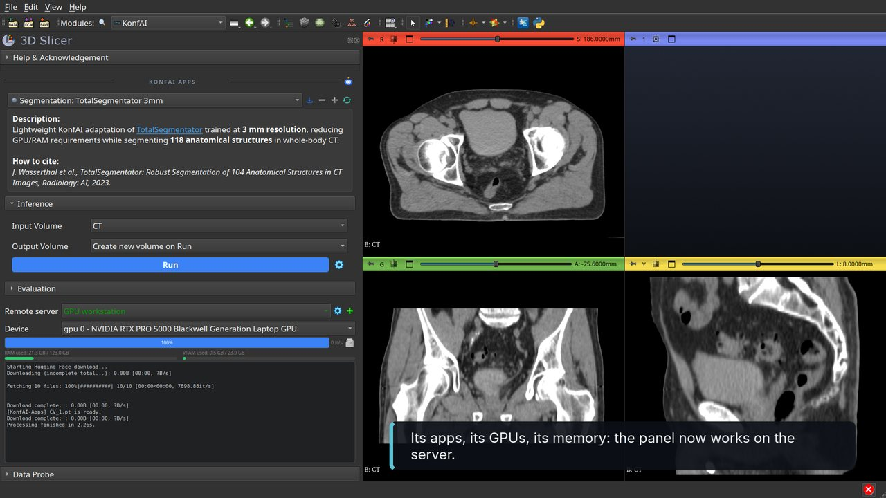

# 🧩 SlicerKonfAI: KonfAI Apps in 3D Slicer

[](https://github.com/vboussot/SlicerKonfAI/blob/main/LICENSE)
[](https://huggingface.co/VBoussot)
[](https://pypi.org/project/konfai-apps/)
[](https://arxiv.org/abs/2508.09823)


**SlicerKonfAI** runs **KonfAI Apps** inside 3D Slicer: published deep learning workflows for **segmentation**, **synthetic CT** and **registration**, packaged with their weights and their inference, evaluation and uncertainty configurations. Load a volume, pick an app from Hugging Face or from a folder, click Run, and get volumes and segmentations back in the scene. The same panel evaluates a result against a reference, estimates its uncertainty without any reference, and runs on the local GPU or on a remote server.

<br>

📚 Reference

> 🔗 KonfAI: A Modular and Fully Configurable Framework for Deep Learning in Medical Imaging
> Valentin Boussot, Jean-Louis Dillenseger
> [arXiv:2508.09823](https://arxiv.org/abs/2508.09823)

---

## 🌐 The KonfAI ecosystem

- **[KonfAI](https://github.com/fideus-labs/KonfAI)**: the engine. Declarative YAML workflows for training, patch-based inference, TTA, ensembles, evaluation; the `konfai-apps` package and CLI; the HTTP server; the MCP server and **KonfAI Studio**.
- **[SlicerKonfAI](https://github.com/vboussot/SlicerKonfAI)** (this repo): the generic Slicer interface and the `KonfAI` library the sister extensions build on.
- **[SlicerImpactSynth](https://github.com/vboussot/SlicerImpactSynth)**: synthetic CT from MRI and CBCT with the [TotalSynth](https://arxiv.org/abs/2609.13838) models.
- **[SlicerImpactReg](https://github.com/vboussot/SlicerImpactReg)**: multimodal registration with the IMPACT metric (elastix, ConvexAdam, FireANTs presets).
- **Apps on Hugging Face**: [TotalSegmentator-KonfAI](https://huggingface.co/VBoussot/TotalSegmentator-KonfAI), [MRSegmentator-KonfAI](https://huggingface.co/VBoussot/MRSegmentator-KonfAI), [ImpactSeg](https://huggingface.co/VBoussot/ImpactSeg), [ImpactSynth](https://huggingface.co/VBoussot/ImpactSynth), [ImpactReg](https://huggingface.co/VBoussot/ImpactReg).

---

## 🎥 Videos

Three walkthroughs of about a minute each, with captions, recorded on a pelvic CT of the public SynthRAD2023 dataset.
👉 Every step with a screenshot: [`TUTORIAL.md`](TUTORIAL.md)

| Run a published app | Quality assurance | Apps, settings and servers |
|---------------------|-------------------|----------------------------|
| [](Screenshots/SlicerKonfAI-inference.mp4) | [](Screenshots/SlicerKonfAI-qa.mp4) | [](Screenshots/SlicerKonfAI-apps.mp4) |
| [`SlicerKonfAI-inference.mp4`](Screenshots/SlicerKonfAI-inference.mp4) | [`SlicerKonfAI-qa.mp4`](Screenshots/SlicerKonfAI-qa.mp4) | [`SlicerKonfAI-apps.mp4`](Screenshots/SlicerKonfAI-apps.mp4) |

<!-- Drop Screenshots/SlicerKonfAI-inference.mp4 into the README editor on GitHub and paste the user-attachments URL it gives here: GitHub then embeds a player. -->

https://github.com/user-attachments/assets/f7b8994e-021e-4635-8547-e550e0ce4037

https://github.com/user-attachments/assets/4768e3e0-323a-4283-bb7b-939aac541a8d

https://github.com/user-attachments/assets/d3728d16-1004-4100-9e8a-f31b8e72ed75


---

## ✨ Key Features

- **Apps from Hugging Face, offline first**
  The app list is built from the local Hugging Face cache and refreshed on demand. Add an app from any repository or from a local folder, download only the checkpoints you need, remove what you do not use. Each app shows an icon, a short description and a full description card with the training data and how to cite.

- **Inference on the volumes of the scene**
  Inputs are Slicer nodes (DICOM, NIfTI, NRRD, MHA, several inputs when the app declares them). Outputs come back as volumes, label maps or Segmentation nodes with the names and colours of the app, and a Show 3D button.

- **Sampling controls that follow the app**
  Checkpoint chips for the ensemble, test-time augmentation and MC dropout appear only when the app supports them. The *Uncertainty* checkbox keeps every sampled prediction as an inference stack for the QA tab.

- **Quality assurance, with or without a reference**
  *With reference*: the app's evaluation workflow (Dice, MAE, PSNR, SSIM and the maps it defines), with an optional mask and a transform to align the output. *No reference*: the app's uncertainty workflow on the inference stack (variance maps, segmentation disagreement).

- **Advanced settings and local apps**
  Override the patch size and the batch size, edit the parameters the app exposes, restore the defaults, or save the current settings as a new local app. Scaffold a fine-tuning app from any app that ships its training configuration.

- **Local GPU, CPU or remote server**
  The device row lists the CPU and every GPU combination. A `konfai-apps-server` on another machine runs the same apps: add it with its host, port and token (kept in the OS keyring), pick one of its GPUs, and the RAM and VRAM gauges show its memory.

- **Live feedback**
  Progress and speed of the running process, RAM and VRAM gauges, the log of the process, a button to open the temporary folder of the run, Stop at any time.

- **A library for sister extensions**
  ImpactSynth, ImpactReg and ImpactSeg are a few lines each: they register app templates on the `KonfAI` facade and inherit every feature above.

- **KonfAI Studio**
  One button starts the local KonfAI Studio web app, a chat interface over the KonfAI MCP server, and opens it in the browser.

---

## 📦 Built-in Apps

| App | Task | Models | Notes |
|-----|------|--------|-------|
| **TotalSegmentator** (KonfAI port) | CT segmentation, 117 structures | `total` (5 models), `total-3mm` (1 model) | 1.8 to 3.9× faster and 2.7 to 4.8× less host RAM than the original tool on the same GPU |
| **TotalSegmentator MRI** (KonfAI port) | MRI segmentation, 50 structures | `total_mr` (2 models), `total_mr-3mm` (1 model) | |
| **MRSegmentator** (KonfAI port) | MRI and CT segmentation, 40 structures | 5 folds | 1.2 to 1.7× faster, 1.4 to 5.4× less host RAM |
| **IMPACT-Seg** | Body mask on CT, MRI and CBCT | `body` | Used by the synthesis apps for their body mask |
| **TotalSynth** ([ImpactSynth](https://huggingface.co/VBoussot/ImpactSynth)) | Synthetic CT from MRI or CBCT | `MR`, `CBCT`, `MR_CBCT`, `Finetune` (5 folds each) | Evaluation against a CT, uncertainty and conformity maps |

The ports reuse the original weights; the speed comes from KonfAI's patch-native inference (GPU accumulation, streamed reads and writes, measured batch size). Details and benchmarks on the Hugging Face cards.

---

## 🚀 Quick Start

1. Install **3D Slicer ≥ 5.10**, then from the **Extensions Manager** the **PyTorch** extension (SlicerPyTorch) and **KonfAI**.
2. Restart Slicer and open **KonfAI** (category **Pipelines**). On the first opening, `konfai-apps` is installed into Slicer's Python.
3. Load a volume (**DICOM** module, or drag and drop a NIfTI / NRRD / MHA file).
4. Choose an app in the list, for example *Segmentation: Total Segmentator*. Select the **input volume**, click **Run**. The segmentation is loaded as a Segmentation node; click **Show 3D**.
5. **QA with a reference**: open **Evaluation**, tab *With reference*, pick the output (a label map for a segmentation, the volume for a synthesis) and the reference, click **Run**. Metrics appear in a list and the result images load with a click.
6. **QA without reference**: at inference, select several checkpoints and tick **Uncertainty**; then tab *No reference (Uncertainty)*, **Run**.

👉 Every step with a screenshot, plus the download dialog, the Advanced dialog, fine-tuning setup, remote servers and Studio: [`TUTORIAL.md`](TUTORIAL.md)

---

## 🧑‍💻 Developer documentation

### 🧩 What is a KonfAI App?

A **KonfAI App** is a self-contained workflow package: a trained model (one checkpoint or an ensemble), the YAML workflows KonfAI executes, and an `app.json` that describes the app to the interfaces. Apps are portable and versioned; they run identically from Python, from the CLI and from Slicer.

```text
my_konfai_app/
├── app.json           # metadata for the interfaces
├── Prediction.yml     # inference workflow
├── Evaluation.yml     # (optional) evaluation against a reference
├── Uncertainty.yml    # (optional) uncertainty from an inference stack
├── Config.yml         # (optional) training workflow, enables fine-tuning
├── Model.py, *.yml    # model definition
├── icon.png           # (optional)
└── CV_0.pt, CV_1.pt   # checkpoints
```

```json
{
    "display_name": "Segmentation: Lung lobes",
    "short_description": "Lung lobe segmentation on CBCT.<br><b>How to cite:</b> ...",
    "description": "Full description shown when the card is expanded (HTML).",
    "task": "segmentation",
    "models": ["CV_0.pt", "CV_1.pt"],
    "tta": 4,
    "mc_dropout": 0,
    "patch_size": [96, 128, 160],
    "inputs": {"CBCT": {"display_name": "CBCT", "volume_type": "VOLUME", "required": true}},
    "outputs": {"Lobes": {"display_name": "Lung lobes", "volume_type": "SEGMENTATION", "required": true}},
    "inputs_evaluations": {"Image": {"Evaluation.yml": {"Seg": {"display_name": "Segmentation", "volume_type": "SEGMENTATION", "required": true},
                                                        "Ref": {"display_name": "Reference", "volume_type": "SEGMENTATION", "required": true}}}},
    "terminology": {"1": {"name": "left_upper_lobe", "color": "#3b82f6"}}
}
```

SlicerKonfAI uses it to name and describe the app (`display_name`, `short_description`, `description`, `icon`, `task` for the default icon), to show the sampling controls (`models`, `tta`, `mc_dropout`), to build the input and output selectors (`inputs`, `outputs`, with `VOLUME`, `SEGMENTATION`, `FIDUCIALS` and `TRANSFORM` types), to build the evaluation tabs (`inputs_evaluations`), to seed the Advanced dialog (`patch_size`) and to name and colour the segments (`terminology`).
👉 Packaging, local and remote apps: [KonfAI documentation, Apps](https://konfai.readthedocs.io/en/latest/usage/apps.html)

### ⚙️ How SlicerKonfAI runs an App

1. A temporary working directory is created for the run.
2. The selected nodes are written to it: volumes as `.mha`, transforms as `.h5`, markups as `.fcsv`.
3. The `konfai-apps` CLI is launched in a separate process:

   ```bash
   konfai-apps infer <app> -i Volume.mha -o Output --ensemble_models CV_0.pt CV_1.pt --tta 2 --mc 0 --gpu 0 \
       [--patch-size 1 512 512] [--batch-size 16] [--set key=value] [-uncertainty] [--host H --port P --token T]
   konfai-apps eval <app> -i Volume.mha --gt Reference.mha [--mask Mask.mha] -o Evaluation --gpu 0
   konfai-apps uncertainty <app> -i InferenceStack.mha -o Uncertainty --gpu 0
   ```

   With a remote server selected, the same CLI posts the job to the server and streams its logs.
4. stdout and stderr are streamed to the log; tqdm output drives the progress bar and the speed label.
5. The outputs are loaded back: `uint8` volumes as Segmentation nodes, other volumes as scalar volumes shown over the input, the inference stack as a Sequence, metrics and result images in the Evaluation panel.

### 🔌 Building a sister extension

The KonfAI extension exposes a stable facade (`from KonfAI import ...`, API version 2). An extension with its own set of apps is a module that registers app templates:

```python
from KonfAI import KONFAI_SLICER_API_VERSION, KonfAIAppTemplateWidget, KonfAICoreWidget, _is_reload_setup

class MyExtensionWidget(ScriptedLoadableModuleWidget):
    def setup(self):
        super().setup()
        self.konfai_core = KonfAICoreWidget("My Extension")
        self.konfai_core.register_apps([
            KonfAIAppTemplateWidget("Segmentation", ["MyOrg/MySegmentationApps"]),
            KonfAIAppTemplateWidget("Synthesis", ["MyOrg/MySynthesisApps"]),
        ])
        self.layout.addWidget(self.konfai_core)
        if _is_reload_setup("SlicerMyExtension"):
            self.konfai_core.enter()

    def enter(self): self.konfai_core.enter()
    def exit(self): self.konfai_core.exit()
    def cleanup(self): self.konfai_core.cleanup()
```

Each template becomes a tab with the app list of its repositories, the inference panel and the evaluation panel. `INFERENCE_PANEL_CLASS` and `QA_PANEL_CLASS` can be overridden for task-specific panels (SlicerImpactReg does this for registration). Set `EXTENSION_DEPENDS "KonfAI"` in `CMakeLists.txt`. The contract test `KonfAI/Testing/Python/KonfAIApiContractTest.py` freezes the facade.

### 🛠️ Run from source

```bash
Slicer --additional-module-paths /path/to/SlicerKonfAI/KonfAI
```

Settings are kept under `KonfAI-Settings` (app lists per template, remote servers, Studio executable) and shared with the sister extensions.

---

## 📚 References

Boussot, V. & Dillenseger, J.-L., **KonfAI: A Modular and Fully Configurable Framework for Deep Learning in Medical Imaging.** *arXiv:2508.09823*, 2025.

Boussot, V., Hémon, C., Barateau, A., Lafond, C., Nunes, J.-C., Dillenseger, J.-L., **TotalSynth: Robust Whole-Body Synthetic CT from MRI and CBCT.** *arXiv:2609.13838*, 2026.

---

> SlicerKonfAI = GUI + data exchange + process manager
> KonfAI = the engine that does all computations
