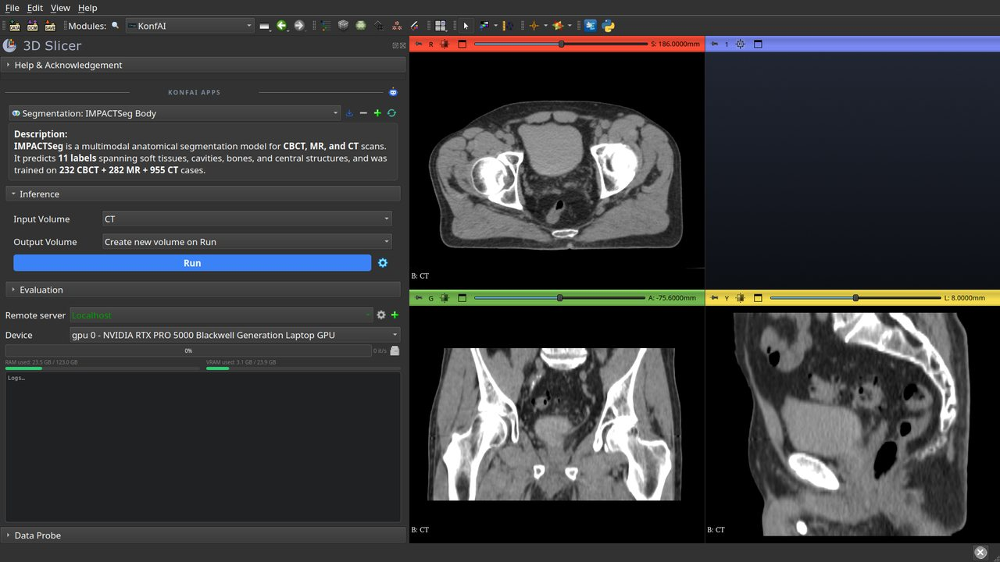
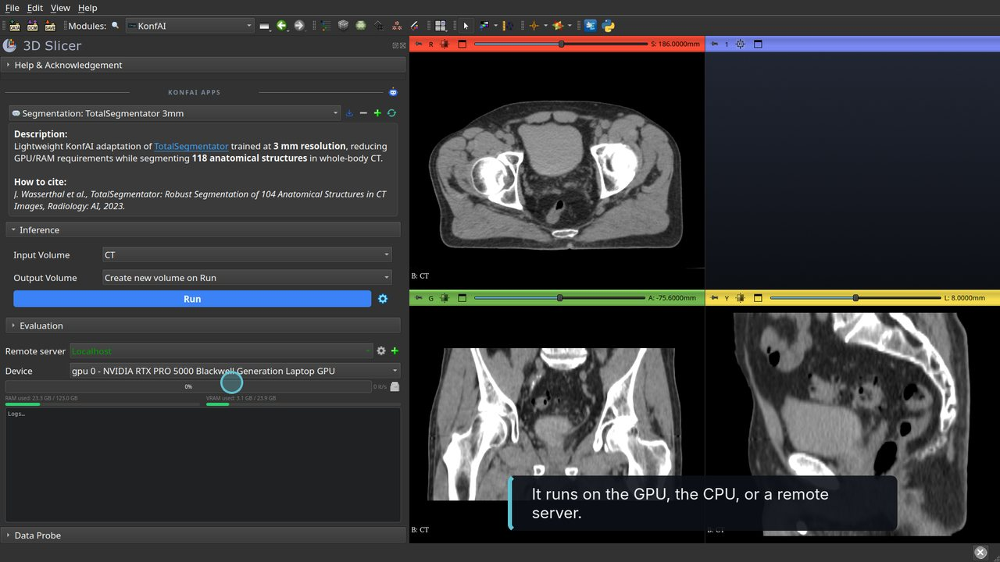
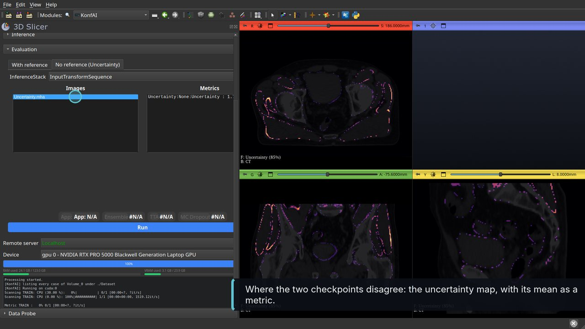
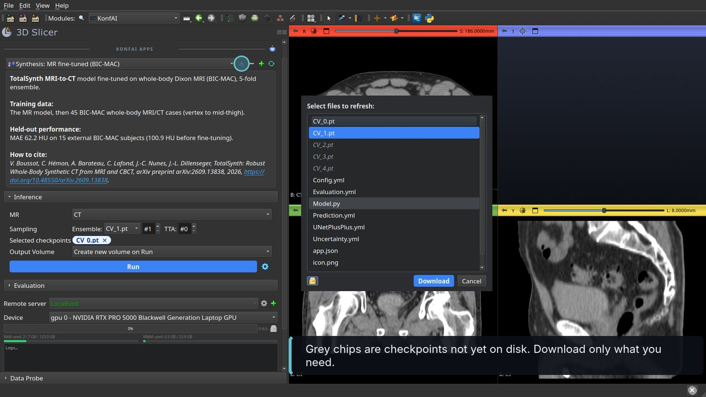
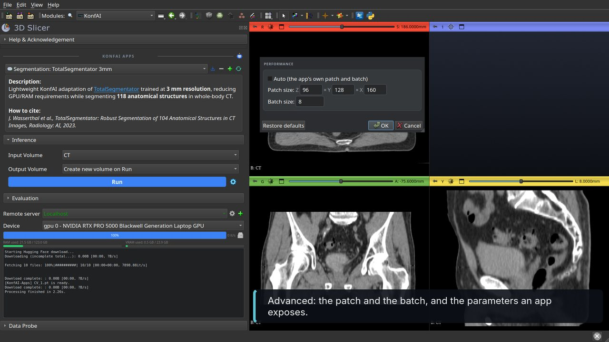
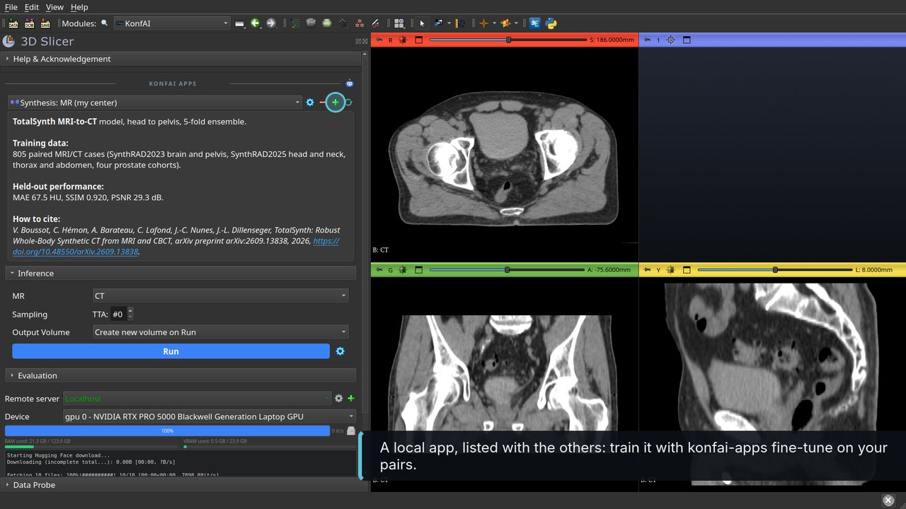
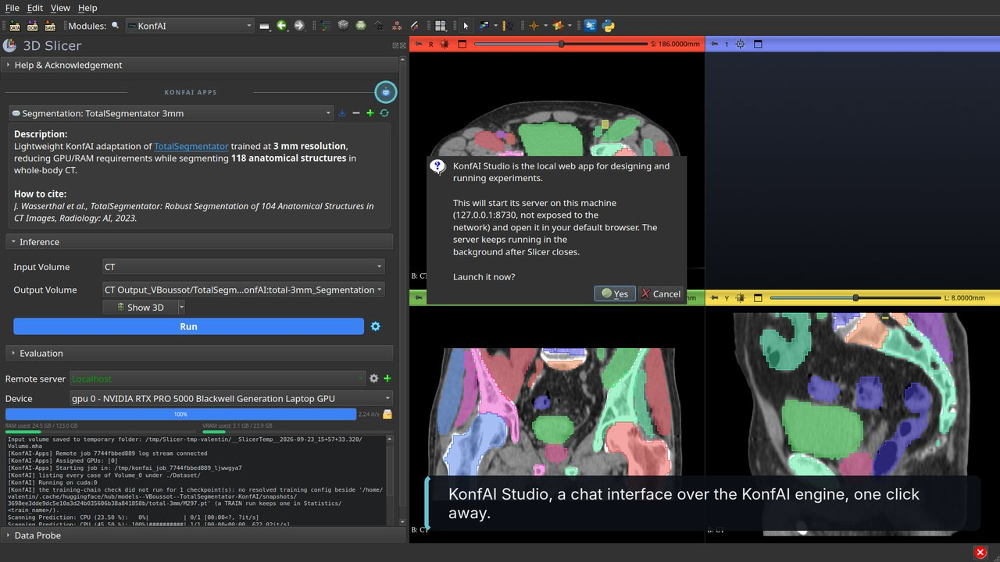

# Walkthrough

Three videos with captions, about a minute each:
[SlicerKonfAI-inference.mp4](Screenshots/SlicerKonfAI-inference.mp4) (run a published app),
[SlicerKonfAI-qa.mp4](Screenshots/SlicerKonfAI-qa.mp4) (quality assurance with and without a reference),
[SlicerKonfAI-apps.mp4](Screenshots/SlicerKonfAI-apps.mp4) (apps, settings, remote servers).

Recorded on a pelvic CT of the public [SynthRAD2023](https://synthrad2023.grand-challenge.org/)
challenge (case 1PC006, 407 × 277 × 105 voxels of 1 × 1 × 2 mm) with its MRSegmentator
reference segmentation, both from the [konfai-demo](https://huggingface.co/datasets/VBoussot/konfai-demo)
dataset, on an RTX PRO 5000 (24 GB). The waits are played faster in the videos. A DICOM series
loaded through the DICOM module works the same way.

## Run a published app

1. **Install** the extension and open **KonfAI** (category *Pipelines*). On the first opening the
   module installs `konfai-apps` into Slicer's Python; PyTorch comes from the SlicerPyTorch
   extension. Load the CT (drag and drop, or *Add Data*). The app list is built from the
   Hugging Face cache; the first time, the apps of the built-in repositories are listed online.

   

2. **Choose an app.** The list holds every app of the built-in repositories (TotalSegmentator,
   MRSegmentator, IMPACT-Seg, TotalSynth) and the ones you added. The card under the list gives
   the short description; click it for the full one, with the training data and how to cite. The
   **Ensemble** row lists the checkpoints of the app as chips (a grey chip is not downloaded yet
   and is fetched at run time); **TTA** and **MC Dropout** appear when the app supports them.
   The **Device** row lists the CPU and every GPU combination.

   

3. **Run.** The input is written to a temporary folder and `konfai-apps infer` runs in a separate
   process. The log shows its output, the progress bar and the speed follow it, and the RAM and
   VRAM gauges show the memory of the selected device. The result is loaded as a Segmentation
   node with the names and colours of the app; **Show 3D** renders it. The folder button next to
   the progress bar opens the temporary folder of the run.

   

## Quality assurance

4. **Evaluate against a reference.** Run MRSegmentator on the CT with two checkpoints and
   **Uncertainty** ticked (this keeps every sampled prediction). Open *Evaluation*, tab
   *With reference*: the output is the label map of the result, the reference is the reference
   label map, a mask and a transform are optional. Run. The *Metrics* list shows the Dice and the
   other metrics defined by the app; click an image of the *Images* list to load it (here the
   error map).

   

5. **Estimate uncertainty without reference.** Tab *No reference (Uncertainty)*: the inference
   stack of the last run is preselected. Run. The app's uncertainty workflow turns the stack into
   maps (here the disagreement between the two checkpoints) and summary metrics.

   

## Apps, settings and servers

6. **Download what you need.** The download button next to the app list opens the list of files
   of the app on Hugging Face; grey checkpoints are not on disk yet. Select the ones to fetch and
   click Download. The chips turn blue when the files are ready.

   

7. **Advanced settings.** The gear next to Run opens the *Advanced inference settings*: untick
   *Auto* to set the patch size and the batch size, edit the parameters the app exposes, restore
   the defaults, or *Save as local app* to keep the settings as a new app. An orange dot on the
   gear shows that an override is active.

   

8. **Add and remove apps.** The plus button offers *Add from folder* (any folder with an
   `app.json`), *Add from Hugging Face* (a repository id, then one of its folders) and
   *Setup fine-tuning*, which scaffolds a fine-tuning app from any app that ships its
   `Config.yml`: choose a folder, a name, the number of epochs and the validation interval; the
   new local app appears in the list, ready for `konfai-apps fine-tune`. The minus button removes
   an added app, and can delete its folder.

   

9. **Remote server.** Start `konfai-apps-server --apps apps.json` on a GPU machine, then add it
   with the plus button of the *Remote server* row: name, host, port and an optional token,
   stored in the OS keyring. Once selected, the app list comes from the server, the *Device* row
   lists its GPUs and the gauges show its memory. Inference, evaluation and uncertainty run there.

   

10. **KonfAI Studio.** The robot button in the header starts the local KonfAI Studio web app, a
    chat interface over the KonfAI MCP server, and opens it in the browser. A right click stops
    the server or points the button at another `konfai-studio` executable.

    

From the command line, the runs of this walkthrough are:

```bash
konfai-apps infer VBoussot/TotalSegmentator-KonfAI:total -i CT.mha -o Output --gpu 0
konfai-apps infer VBoussot/MRSegmentator-KonfAI:MRSegmentator -i CT.mha -o Output --gpu 0 --ensemble 2 -uncertainty
konfai-apps eval VBoussot/MRSegmentator-KonfAI:MRSegmentator -i Output/Segmentation.mha --gt SEG.mha -o Evaluation --gpu 0
konfai-apps uncertainty VBoussot/MRSegmentator-KonfAI:MRSegmentator -i Output/InferenceStack.mha -o Uncertainty --gpu 0
konfai-apps-server --host 0.0.0.0 --port 8000 --apps apps.json
```
